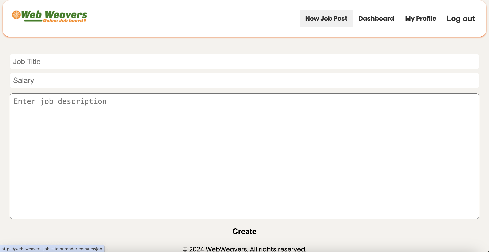

# Web Weavers Job Site
  
 
  ## table of contents 
  *  [Description](#description)
  *  [Deployed](#deployed)
  *  [Installation](#installation)
  *  [Usage](#usage)
  *  [License](#license)
  *  [Contributions](#contributions)
  *  [Questions](#questions)
  
  
## Description
Our motivation to create this project was to make a to create a job posting site where users can search for posts and recruiters can post job postings. We built this project to create a streamlined way to add, remove, and update job postings and to create opportuinties for job seekers. This site solves the problem of not having a website for job seekers to see current jobs that are available to them and to be able to apply to them. We learned how to build a full stack application by using node, PostgreSQL, api routes, middlewares, handlebars, Javascript, CSS, and HTML.

## Deployed Site

The deployed site is available here. https://web-weavers-job-site.onrender.com/

## Installation

To install the app from the GitHub repository located at https://github.com/stefanfilm/WebWeaversJobSite, follow these steps:

1. Clone the repository itself. 

2. Install dependencies by running: npm install.

3. Seed the database by running: npm run seed.

4. Deploy the app on Render by following the deployment instructions on their platform.

5. Click on the live link: https://web-weavers-job-site.onrender.com/

## Usage

Navigate to the deployed website. Click on sign up. Sign up as a job seeker or a recruiter. If you sign up as a job seeker, you will be able to view job posts on your dashboard and apply to them. You could click on "My Profile" and add a photo to your profile. You could click on any of the available jobs listed and apply to them by clicking apply. If you sign up as a recruiter, you can create job posts by clicking "New Job Post". You can see who applied to your job postings by clicking on "Dashboard". You can click "Log Out" to log out of the application.


    ```md
    
    ```


  ## License
  This project is licensed with the MIT license.
  

  ## Contributions
  Jose Arambula, Thinh Nguyen, Alex Turrietta, and Stefan Wanigatunga contributed to this project. 
  

  ## Questions
  Jose Arambula github: daimyo1 
  Thinh Ngyuen github: swe-thinhnguyen1701
  Alex Turrietta github: turriettaa
  Stefan Wanigatunga github: stefanfilm
